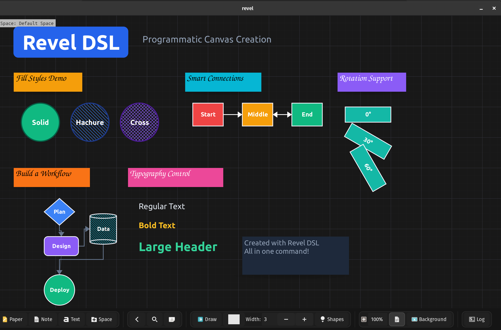
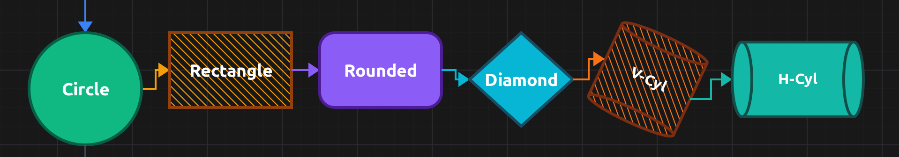
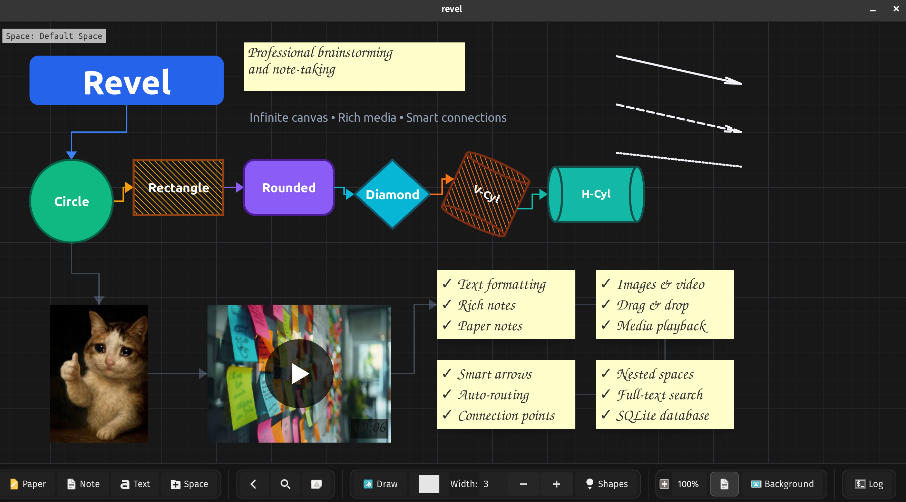

In my [previous post](https://velostudio.github.io/blog/revel.html), I introduced [Revel](https://github.com/Dimchikkk/revel) - an infinite canvas note-taking app written in C. Since then, I've been using it daily and adding features that make it genuinely productive. Today I want to share what makes Revel unique: its **Domain Specific Language (DSL)** and several powerful features I haven't seen together in other tools.

Building Revel took about **one month** of coding, and honestly, it was **one of the most fun projects** I've ever worked on in C. There's something deeply satisfying about writing systems-level code that directly manipulates pixels, manages memory, and produces instant visual feedback. No framework overhead, no build step hell - just pure C, GTK4, and SQLite3.

## The DSL: Automating the Canvas

One feature I'm particularly proud of is Revel's **DSL (Domain Specific Language)**. It lets you programmatically create entire canvas layouts with a simple text script. Think of it as "Infrastructure as Code" but for visual brainstorming.

Here's a taste of what the DSL looks like:

```
canvas_background (0.15,0.15,0.18,1.0) true (0.25,0.25,0.30,0.5)

note_create title "My Project" (50,50) (280,70) bg #2563eb text_color #FFFFFF font "Ubuntu Bold 36"

shape_create s1 circle "Design" (50,200) (120,120) bg #10b981 stroke 3 filled true text_color #FFFFFF
shape_create s2 rectangle "Build" (200,200) (130,80) bg #f59e0b stroke 3 filled true fill_style solid text_color #000000
shape_create s3 diamond "Deploy" (360,200) (110,100) bg #8b5cf6 stroke 3 filled true rotation 15 text_color #FFFFFF

connect s1 s2 parallel single #3b82f6
connect s2 s3 parallel double #f59e0b

image_create screenshot examples/demo.jpg (50,350) (300,200)
video_create demo examples/video.mp4 (400,350) (320,200)
```

**Why is this useful?**

- **Reproducible layouts** - Save your canvas setup as a script and recreate it anytime
- **Template-driven workflows** - Create project templates, meeting notes, or design patterns
- **Batch operations** - Generate dozens of connected elements in seconds
- **Version control** - Track changes to your canvas structure in git
- **Documentation** - Your canvas layout becomes self-documenting code

I've created a demo DSL file that showcases various features. You can run it yourself:

```bash
make -B -j 7 && ./revel --dsl examples/blog_dsl_demo.dsl
```



The implementation is straightforward C: a simple parser that tokenizes the DSL commands and calls the same internal functions the GUI uses. No external parser generators, no complex AST - just string manipulation and direct API calls. This is the beauty of C: you can build powerful features without pulling in heavyweight dependencies.

## Rich Element Types with Extensive Styling

Revel supports multiple element types including shapes (circle, rectangle, rounded rectangle, diamond, vertical cylinder, horizontal cylinder, arrow, line, triangle), text elements, notes, paper notes, spaces, images, and videos.

What makes these elements special:

- **Fill Styles (shapes only):** Choose between `solid`, `hachure` (hand-drawn hatching), or `crosshatch` fills. This gives your diagrams a sketch-like aesthetic that feels less sterile than typical diagramming tools.
- **Stroke Styles (shapes only):** Solid, dashed, or dotted outlines with configurable width and color.
- **Rotation:** Any element can be rotated to any angle. Want a tilted cylinder or a diagonal arrow? Just add `rotation 45` to the DSL command.
- **Text Labels:** Elements can contain text with full typography control (font family, size, bold/italic, color).



Here's an example creating a rotated cylinder with hachure fill:

```
shape_create cyl vcylinder "Database" (100,100) (120,150) bg #f97316 stroke 3 stroke_color #7c2d12 filled true fill_style hachure text_color #FFFFFF font "Ubuntu Bold 16" rotation 25
```

## Smart Arrow Routing

Connecting elements visually is crucial for brainstorming and system design. Revel's **arrow system** supports:

- **Parallel arrows** - Multi-segment perpendicular connections between elements
- **Straight arrows** - Direct point-to-point connections
- **Arrowhead types** - None, single, or double arrowheads
- **4-point connection system** - Snap to top, bottom, left, and right of elements
- **Custom colors** - Including alpha transparency for subtle connections

```
connect element1 element2 parallel single #3b82f6
connect element2 element3 straight double #f59e0b
connect element3 element4 straight none #64748b60
```

The parallel arrow algorithm creates clean perpendicular connections that make your diagrams look polished without manual adjustment. Revel automatically determines optimal connection points by calculating the nearest points between elements - as you move elements around, connections dynamically update to use the best anchor points (top, bottom, left, or right).

## Media Integration: Images and Video

Revel treats **media as first-class citizens**. You can:

* **Paste images** directly from clipboard (Ctrl+V)
* **Drag & drop** images and videos from your file manager
* **Play MP4 videos** inline with GStreamer integration
* **Store everything** in the SQLite database (images and small videos as BLOBs)

```
image_create photo examples/media/cat.jpeg (50,400) (200,200)
video_create clip examples/media/demo.mp4 (300,400) (320,200)
```

This is where Revel diverges from traditional note-taking apps. Instead of linking to external files that might move or get deleted, everything lives inside one portable `.db` file. Your entire knowledge base - text, images, videos, canvas layouts - is a **single file** you can backup, version, or sync however you want.

## Element Cloning: Fork vs Clone

This is a concept I haven't seen in other tools. Revel distinguishes between:

**Fork** - Creates an independent copy. Change the copy, and the original stays unchanged.

**Clone** - Creates a linked copy. Clones can share specific properties:

- **Clone by text** - Multiple elements share the same text content
- **Clone by size** - Multiple elements maintain identical dimensions
- **Clone by position** - Multiple elements move together
- **Clone by color** - Color changes propagate across clones

For example, let's say you're designing a UI mockup with multiple buttons that should always have the same dimensions. Clone them by size, and resizing one automatically resizes all linked clones. Change the text independently, but the size stays synchronized.

This is implemented in C using a reference system in SQLite. Each element can reference a unique property ID that's shared between cloned visual elements. The UI listens for model changes and updates all elements that should be synchronized.

## Nested Spaces: Infinite Hierarchy

**Spaces** are both containers *and* elements. This means:

- A space can contain notes, images, shapes, videos, and *other spaces*
- Each space is an infinite canvas
- You can zoom into a space and keep working
- **Infinite depth** - spaces within spaces within spaces...

Want to organize a project? Create a top-level space called "Website Redesign", then create sub-spaces for "Research", "Wireframes", "Assets", etc. Each sub-space is its own infinite canvas.

The implementation allows even weirder things:

- **Circular references** - Space A contains Space B, Space B contains Space A
- **Orphaned spaces** - Spaces that aren't children of any other space, but still searchable via full-text search

This flexibility comes from treating spaces as graph nodes rather than a strict tree hierarchy. It's stored in SQLite with simple `parent_id` references, letting you build whatever structure makes sense for your workflow.

## Full-Text Search with BM25

With all this content, you need a way to find things. Revel uses **SQLite's FTS5 extension with BM25 ranking**. This is the same algorithm used by search engines.

Press **Ctrl+S** and start typing. Revel searches:

- Note text content
- Text labels in shapes
- All text-based elements

Results are ranked by relevance, and you can jump directly to any element, even if it's nested deep in another space.

The BM25 implementation is essentially free - SQLite does all the heavy lifting. In C, it's just a matter of executing the right SQL query:

```c
SELECT ets.element_uuid, ets.text_content, ets.space_uuid, s.name
FROM element_text_fts ets
JOIN spaces s ON ets.space_uuid = s.uuid
WHERE ets.text_content MATCH ?
ORDER BY bm25(element_text_fts);
```

## Why C? Why GTK4?

I mentioned in my first post that I previously built [Velo](https://github.com/Dimchikkk/velo) in Rust. Rust is an amazing language, but I wanted to learn C and GTK4 is an excellent GUI toolkit that works beautifully with C.

With GTK4 in C:

- **Direct API access** - No wrapper overhead
- **Fast compilation** - `make -j 7` builds the entire project almost instantly
- **Readable debugging** - GDB works perfectly, stack traces are clean
- **Straightforward** - No hidden complexity, what you write is what runs

The entire codebase is over 15,000 lines of C. No build system complexity, no dependency hell, no framework magic.

I built Revel on my lovely ThinkPad laptop running Linux. It should work on Unix systems, though Windows would need some tweaks since it uses GStreamer for video playback.

## What's Next?

I'm actively using Revel daily for:

- Project planning and task tracking
- Technical design documents with diagrams
- Learning notes with screenshots and video clips
- Interview preparation (yes, I'm job hunting!)

If there's demand, I could add **multiplayer support** for collaborative editing. Or I could create specialized space types - imagine a music player space or a Trello-like dashboard space for project management.

The most exciting direction is **AI integration**. Since Revel has a DSL, I can ask AI to generate complex layouts. I already used AI to create visualizations for the README. But imagine this: you ask "explain species of cats" and an AI model downloads relevant images from the web, creates a diagram showing the hierarchy, loads everything into Revel with proper connections and labels. The DSL makes this kind of automation possible. Isn't that amazing?

One more thing: I first started using AI agents in the middle of this project, and my experience was **mind-blowing**. The productivity boost was incredible.

## Job Search

I'm currently **looking for a full-time software engineering role** where people are solving complex technical challenges. If you know of opportunities - or if your team is building something interesting - please reach out: **velo.app1@gmail.com**

Building Revel in one month reminded me why I love programming: turning ideas into working software that solves real problems. The fact that it's written in C, uses rock-solid dependencies (GTK4, SQLite3, GStreamer), and stores everything in a single portable file means this tool will keep working for decades. No dependency rot, no framework obsolescence - just code that does its job.

If you want to try Revel, check out the [GitHub repo](https://github.com/Dimchikkk/revel). Run the showcase DSL to see what it can do:

```bash
git clone https://github.com/Dimchikkk/revel
cd revel
make -B -j 7
./revel --dsl examples/showcase.dsl
```



Thanks for reading! Feel free to reach out with questions or feedback.

---

**Links:**

- GitHub: [github.com/Dimchikkk/revel](https://github.com/Dimchikkk/revel)
- Previous post: [Revel: My Experiment in Infinite, Portable Note-Taking](https://velostudio.github.io/blog/revel.html)
