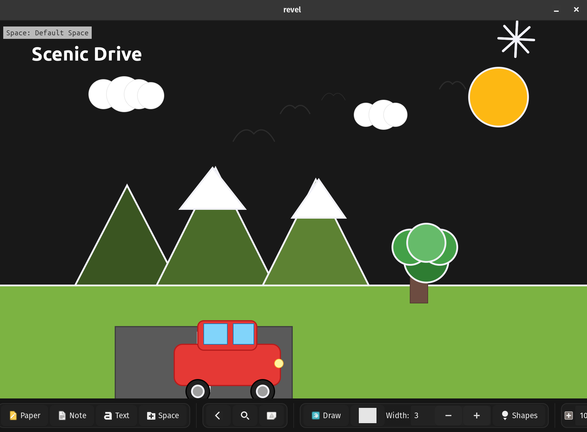
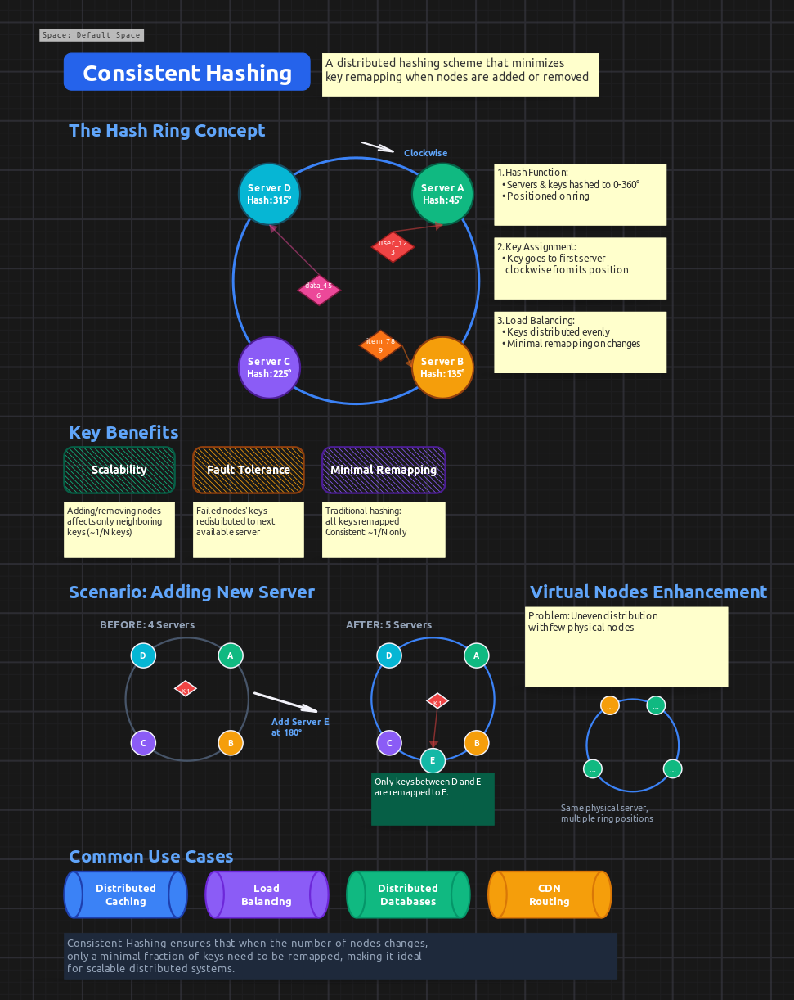
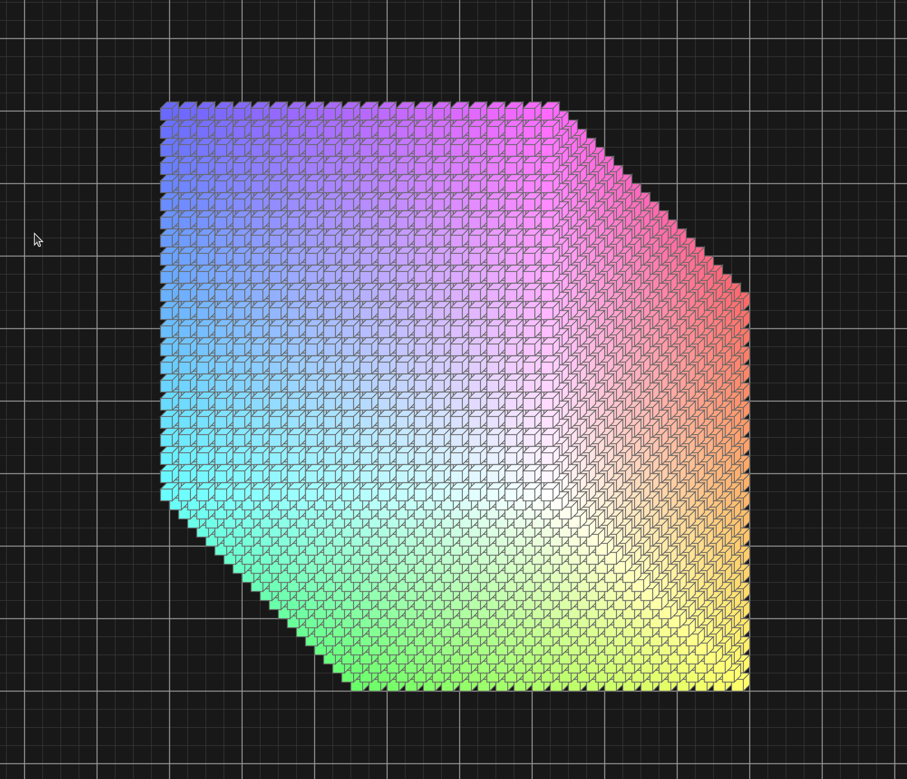
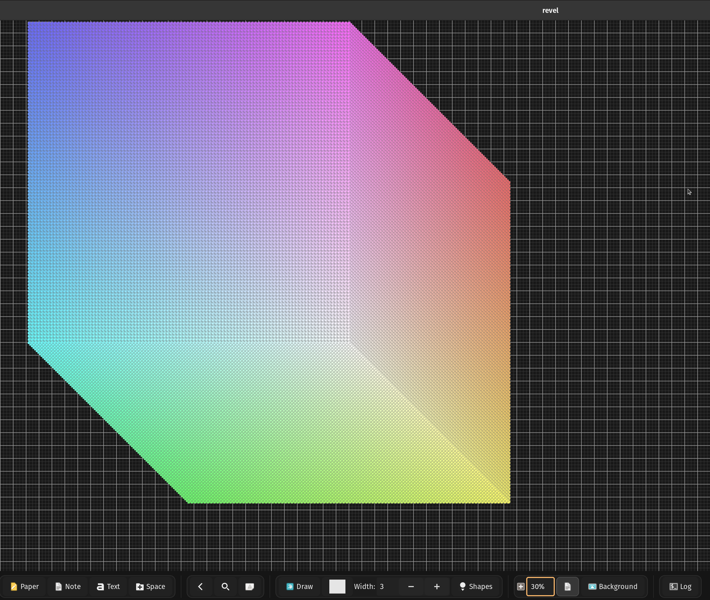

Not so long ago, I wrote about [Revel's DSL](https://velostudio.github.io/blog/revel-part-2.html) and how it enables programmatic canvas generation. Today I'm excited to share some experiments I've been doing with DSL and AI - and how I used a python script to stress-test the app, which led me down a rabbit hole of performance optimization that culminated in rendering **1 million cubes**.

## AI Meets DSL: Surprisingly Good Results

The journey started when I added **Bézier curves** to Revel and extended the DSL to support them. I wanted to test if AI could actually create something visually appealing using the DSL syntax. So I asked Claude to generate a scenic image.

Surprisingly, it drew a pretty cute scene! A car driving through mountains with a sun, clouds, and even birds flying - all created programmatically using **49 elements**.



*Generated from [ai_drawing.dsl](https://github.com/Dimchikkk/revel/blob/0769a66b9c459d1b5b8165dd24505274bf595a1c/examples/ai_drawing.dsl)*

I understand AI can generate realistic videos in 2025, but I was still genuinely surprised it could compose such a charming scene using primitive shapes and Bézier curves. And this isn't a static image - you can adjust the scene yourself if needed since everything is built from adjustable DSL elements.

## AI as a Technical Interviewer

Then I started playing with something more useful for me personally. I took a common interview concept and asked AI to explain it visually using Revel's DSL. By the way, I'm looking for a full-time software engineering role - if you or your team are solving complex technical challenges, reach out at **velo.app1@gmail.com**.

I asked it to create a diagram explaining **consistent hashing**, and it did surprisingly well! The explanation was clear and would probably pass an interview.



*Generated from [ai_consistent_hashing.dsl](https://github.com/Dimchikkk/revel/blob/0769a66b9c459d1b5b8165dd24505274bf595a1c/examples/ai_consistent_hashing.dsl)*

Again, it's all adjustable - you can use this as a starting point and add your own touches. And I didn't even use the most advanced AI model available!

## The Performance Challenge: From 10K to 1 Million

After these experiments, I added support for drawing **3D cubes** as a shape type. Then an idea struck me: let's stress-test the app by drawing a huge 3D structure made of smaller cubes.

That's how a **whole day journey of optimization** began.

I wrote a [Python script](https://github.com/Dimchikkk/revel/blob/0769a66b9c459d1b5b8165dd24505274bf595a1c/examples/cube_generator.py) that generates DSL files with different amounts of cubes arranged in a 3D grid:

```python
def generate_dsl(N):
    s = 20
    offset_x = 1000
    offset_y = 1000
    for i in range(N):
        for j in range(N):
            for k in range(N):
                x_pos = offset_x + i * s - k * s * 0.5
                y_pos = offset_y + j * s - k * s * 0.5
                # Gradient coloring based on position
                r = int(i / (N-1) * 150) + 105
                g = int(j / (N-1) * 150) + 105
                b = int(k / (N-1) * 150) + 105
```

The script generates NxNxN cubes with an isometric 3D perspective and gradient coloring.

### The Starting Point: 10,000 Cubes

Initially, I could barely handle **10,000 cubes** (a 22×22×22 grid). Anything more would completely freeze the app.



The problem was obvious: I was rendering every single element on every draw call, sorting all elements by z-index, and hitting the database with individual queries for each operation.

### Optimization Round 1: Frustum Culling

The first major optimization was **view frustum culling** - only rendering elements that are actually visible in the viewport.

In [canvas_core.c:475-498](https://github.com/Dimchikkk/revel/blob/0769a66b9c459d1b5b8165dd24505274bf595a1c/src/canvas_core.c#L475-L498), I added:

```c
// Calculate visible area for culling FIRST
int visible_x = -data->offset_x;
int visible_y = -data->offset_y;
int visible_width = gtk_widget_get_width(data->drawing_area) / data->zoom_scale;
int visible_height = gtk_widget_get_height(data->drawing_area) / data->zoom_scale;

// OPTIMIZATION: Collect only visible elements first, then sort
GList *visible_elements = NULL;

for (GList *l = visual_elements; l != NULL; l = l->next) {
    Element *element = (Element*)l->data;

    // View frustum culling - skip elements completely outside viewport
    if (element->x >= visible_x + visible_width ||
        element->y >= visible_y + visible_height ||
        element->x + element->width <= visible_x ||
        element->y + element->height <= visible_y) {
        continue;
    }
    visible_elements = g_list_prepend(visible_elements, element);
}

// Sort only the visible elements by z-index
visible_elements = g_list_sort(visible_elements, compare_elements_by_z_index);
```

This was huge. Instead of sorting and rendering all elements, we now only process what's actually on screen.

This brought me to **15,000 cubes**.

### Optimization Round 2: Quadtree Spatial Indexing

The next bottleneck was element picking - determining which element the user clicked on. With thousands of elements, iterating through all of them on every mouse click was unacceptable.

I implemented a **quadtree spatial index** ([quadtree.c](https://github.com/Dimchikkk/revel/blob/0769a66b9c459d1b5b8165dd24505274bf595a1c/src/quadtree.c)) that partitions the 2D canvas space hierarchically:

```c
static void quadtree_node_insert(QuadTreeNode *node, Element *element) {
    if (!bounds_intersects_element(&node->bounds, element)) {
        return;
    }

    if (node->depth >= MAX_DEPTH || node->elements->len < MAX_CAPACITY) {
        g_ptr_array_add(node->elements, element);
        return;
    }

    if (node->children[0] == NULL) {
        quadtree_node_subdivide(node);
    }

    // Insert into appropriate child quadrants
    for (int i = 0; i < 4; i++) {
        quadtree_node_insert(node->children[i], element);
    }
}
```

The quadtree includes optimizations for rotated elements using axis-aligned bounding boxes and fast-path checking for non-rotated elements (the common case).

With quadtree picking, element selection went from O(n) to O(log n), making the app responsive even with tens of thousands of elements. Combined with frustum culling, I could now handle **100,000 cubes**.

### Optimization Round 3: Database Layer

The next bottleneck was SQLite. I was hammering the database with individual inserts for each element when loading DSL files.

I added some SQLite pragmas for better performance (WAL mode, larger cache, memory temp storage), but the biggest win was **transaction batching**. Originally, the DSL executor was creating individual transactions for each element. I refactored it to wrap the entire DSL execution in a single transaction:

```c
database_begin_transaction(canvas->model->db);
// ... create thousands of elements ...
database_commit_transaction(canvas->model->db);
```

This change alone was **massive**. SQLite's performance with bulk inserts inside a single transaction is orders of magnitude faster than individual transactions.

I also rewrote several queries to use JOINs instead of separate queries, which reduced round-trips to the database.

Combined with these optimizations, database operations went from being the primary bottleneck to barely noticeable.

### Other Optimizations

Beyond the major changes, I made several smaller improvements. The space tree view (which shows the hierarchy of spaces in a sidebar) now builds lazily - it only constructs the tree when you actually open it, instead of building on app start.

### The Final Push: 1 Million Cubes

With all these optimizations in place, I finally reached my goal: **1,000,000 cubes** (a 100×100×100 grid).



The app can:

- Load the DSL file with 1 million elements
- Save them to the SQLite database
- Open the database with 1 million elements
- Pick elements efficiently (using quadtree indexing)

I decided to stop here. I will never have anywhere close to 1 million elements in a single space in real-world usage. Mission accomplished.

## The Results

Revel now handles extreme stress tests that go far beyond real-world usage. The optimizations I implemented for the 1 million cube challenge benefit everyday use:

- Smoother scrolling with hundreds of elements
- Instant element picking even in dense diagrams
- Fast database saves and loads
- Responsive UI regardless of canvas complexity

I'm still actively using Revel daily for project planning, technical diagrams, and interview preparation. The combination of DSL automation and AI generation opens up interesting possibilities. Imagine asking an AI to "draw the system design of Netflix-like distributed system" and having it generate a fully-interactive, editable architecture diagram with all the components, connections, and explanations.

If you want to try the stress test yourself:

```bash
# Generate 100x100x100 cube DSL (1 million cubes)
python examples/cube_generator.py 100

# Load it into Revel
./revel --dsl examples/ai_cube.dsl
```

*Warning: This will take some time to load and use several GB of RAM. Start with smaller values like 20 (8,000 cubes) to get a feel for it.*

Building this in C continues to be a joy. No dependency hell, no framework magic, no compilation slowdowns. Just straightforward systems programming with direct control over performance.

---

**Links:**

- GitHub: [github.com/Dimchikkk/revel](https://github.com/Dimchikkk/revel)
- Part 1: [Revel: My Experiment in Infinite, Portable Note-Taking](https://velostudio.github.io/blog/revel.html)
- Part 2: [Building a DSL for Canvas Automation in C](https://velostudio.github.io/blog/revel-part-2.html)
