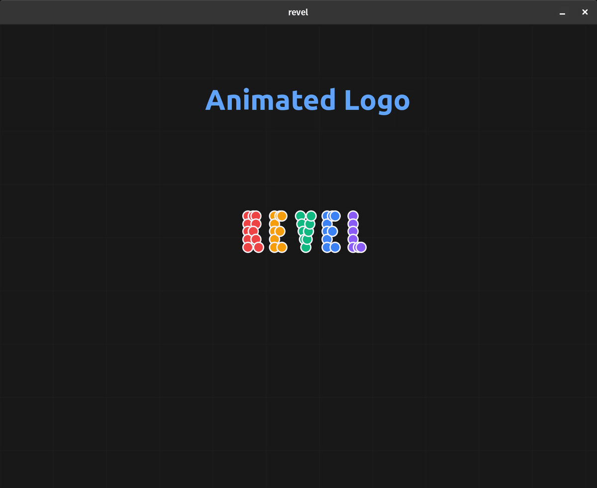
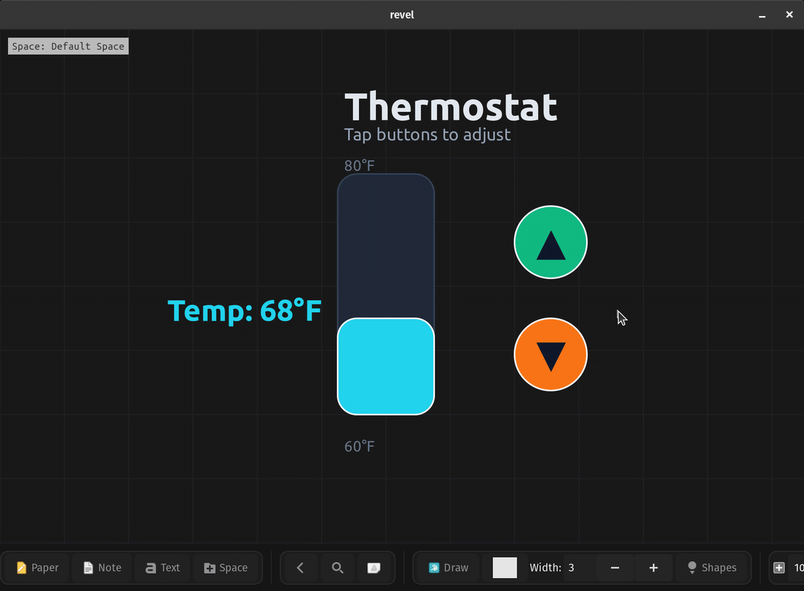

After [optimizing Revel to handle 1 million cubes](https://velostudio.github.io/blog/revel-one-million-cubes.html), I decided to add animations to make my notes more dynamic. What started as "let's make shapes move smoothly" spiraled into building an entire reactive UI framework with variables, event handlers, and presentations. Then I realized something wild: **the DSL (Domain Specific Language) is Turing-complete**. You can implement cellular automata, build interactive quizzes, and create data visualizations, all inside a note-taking app.

This post documents how a simple animation system evolved into something that can theoretically compute anything.

## The Animation Foundation

Every complex system needs solid fundamentals. I implemented eight interpolation curves to make animations feel natural:

**immediate**: Instant jumps (no interpolation)

**linear**: Constant speed motion

**bezier**: Smooth professional ease-in-out

**ease-in/ease-out**: Acceleration/deceleration curves

**bounce**: Playful bouncing effect at the end

**elastic**: Spring-like oscillation

**back**: Overshoots then settles


The syntax follows a consistent pattern: **what → where → when → how long → how**

```python
animation_mode

shape_create star circle "⭐" (100,100) (60,60) bg #ffd700 filled true
animate_move star (100,100) (500,300) 0.0 2.0 bezier
animate_resize star (60,60) (120,120) 0.0 2.0 elastic
animate_rotate star 0 360 0.0 2.0 linear
animate_color star #ffd700 #ff0000 2.0 1.5 bezier
```

Five animation primitives cover everything: `animate_move`, `animate_resize`, `animate_rotate`, `animate_color`, and `animate_appear`/`animate_disappear` for opacity transitions. Multiple animations stack seamlessly. A shape can move, resize, rotate, and change color simultaneously.



Animations can play once (`animation_mode`) or loop forever (`animation_mode cycled`). Looping mode is perfect for breathing buttons, rotating logos, or any continuous visualization.

## Presentation Mode: Slides and Navigation

Once I had smooth animations, I realized this could be a presentation tool. Why not split scripts into slides?

I added `animation_next_slide` as a slide delimiter. Press **Ctrl+Right Arrow** to advance forward, **Ctrl+Left Arrow** to go back. Each slide starts fresh, previous elements clear automatically, but you maintain forward progress through your narrative.

```python
# Slide 1: Title
animation_mode
canvas_background (0.08,0.08,0.12,1.0) true
text_create title "Welcome to Revel" (400,300) (400,100) text_color #60a5fa font "Ubuntu Bold 48"
animate_appear title 0.0 1.2 bezier

animation_next_slide

# Slide 2: Content reveals
text_create header "Key Features" (100,80) (800,60) text_color #3b82f6 font "Ubuntu Bold 36"
shape_create box1 roundedrect "Infinite Canvas" (120,200) (350,100) bg #1e40af filled true
shape_create box2 roundedrect "DSL Automation" (120,320) (350,100) bg #1e40af filled true
animate_appear box1 0.5 0.6 bezier
animate_appear box2 1.2 0.6 bezier
```


Each slide can have its own animation mode. You can mix static slides with animated ones, or create continuously looping visualizations. Hide the toolbar with **Ctrl+Shift+T** for distraction-free presentations.

## Variables and Reactivity: Building Interactive Systems

Here's where it gets interesting. Static presentations are nice, but what about **interactive dashboards**? What if elements could respond to clicks and update based on calculated values?

I added four variable types with full expression support:

```python
int sales_q1 1000
int sales_q2 1500

# Computed from other variables
int total {sales_q1 + sales_q2}

# String interpolation
string status "Total: ${total}"

# Boolean expressions
bool is_profitable {total > 2000}

real growth_rate {(sales_q2 - sales_q1) / sales_q1}
```

Then came event handlers. This is the magic that makes everything reactive:

```python
shape_create button roundedrect "Click Me" (100,100) (150,60) bg #3b82f6 filled true
text_create counter_label "Clicks: 0" (100,200) (200,40) font "Ubuntu 20"

int clicks 0

on click button
  set clicks {clicks + 1}
  text_update counter_label "Clicks: ${clicks}"
end

on variable clicks
  animate_color button #3b82f6 #10b981 0.0 0.3 bezier
end
```

The **`on click`** handlers fire when elements are clicked. The **`on variable`** handlers fire whenever a variable changes. This creates a reactive system where data changes automatically propagate through your UI.

### Real Example: Interactive Sales Dashboard


```python
int data_q1 1000
int data_q2 1500
int data_q3 1200
int data_q4 1800
int total {data_q1 + data_q2 + data_q3 + data_q4}

text_create title "Sales Dashboard" (400,50) (400,60) font "Ubuntu Bold 36"
text_create total_label "Total: ${total}" (400,120) (300,40) text_color #22c55e font "Ubuntu Bold 24"

# Bars positioned based on their values
shape_create bar1 rectangle "Q1" (150,{600 - data_q1/5}) (80,{data_q1/5}) bg #3b82f6 filled true
shape_create bar2 rectangle "Q2" (280,{600 - data_q2/5}) (80,{data_q2/5}) bg #8b5cf6 filled true

on click bar1
  # Add $100 to Q1
  set data_q1 {data_q1 + 100}
end

on variable data_q1
  animate_resize bar1 (80,{data_q1/5}) 0.0 0.4 bezier
  animate_move bar1 (150,{600 - data_q1/5}) 0.0 0.4 bezier
end

on variable total
  text_update total_label "Total: ${total}"
end
```

Click a bar → variable updates → animation triggers → total recalculates → label refreshes. Pure reactive data flow with smooth animations.

### Interactive Thermostat Control



```python
int current_temp 68
int min_temp 60
int max_temp 80

text_create readout "Temp: ${current_temp}°F" (200,320) (220,60) text_color #22d3ee font "Ubuntu Bold 28"
shape_create gauge_fill roundedrect "" (420,280) (120,{(current_temp - min_temp) * 10}) bg #22d3ee filled true

shape_create up_btn circle "▲" (640,220) (90,90) bg #10b981 filled true
shape_create down_btn circle "▼" (640,360) (90,90) bg #f97316 filled true

on click up_btn
  set current_temp {current_temp + 1}
end

on click down_btn
  set current_temp {current_temp - 1}
end

on variable current_temp
  text_update readout "Temp: ${current_temp}°F"
  animate_resize gauge_fill (120,{(current_temp - min_temp) * 10}) 0.0 0.35 bezier
end
```

Every button click updates the temperature, which triggers the gauge to animate smoothly to the new value. The readout updates in real-time. All declarative, all reactive.

## Turing Completeness: Rule 110 Cellular Automaton

Here's the moment I realized this DSL had gone beyond a simple scripting language. I implemented **Rule 110**, a Turing-complete cellular automaton, in 69 lines of DSL code. When you click START, it dynamically generates **250,000 visual elements** (500 cells × 500 generations) in real-time, creating a mesmerizing fractal pattern.

<a href="rule110.png" target="_blank" style="cursor: zoom-in"></a>

Rule 110 is proven to be capable of universal computation. If you can implement Rule 110, your language can theoretically compute anything. Here's how it works in Revel:

### The Setup

```python
canvas_background (0.05,0.05,0.08,1.0) false

# Current generation: 500 cells
int c[500] 0

# Seed with rightmost cell alive
set c[499] 1

# Next generation buffer
int next[500] 0

# Generation counter
int gen 0

# State machine: 0=idle, 1=draw, 2=compute, 3=copy
int step 0

shape_create btn rectangle "START" (400,20) (150,50) filled true bg (0.2,0.6,0.9,1.0)
text_create lbl "Gen: 0 / 500" (570,30) (150,30) text_color (0.8,0.8,0.8,1.0)

on click btn
  # Launch the simulation
  set step 1
end
```

### The State Machine

The simulation runs through three phases, orchestrated by the `step` variable:

**Phase 1: Draw** (Render the current generation as a row of pixels)

```python
on variable step == 1
  set gen {gen + 1}
  for i 0 499
    shape_create r${gen}c${i} rectangle "" ({10+i*6},{120+gen*6}) (5,5) filled true bg {c[i],c[i],c[i],1.0}
  end
  text_update lbl "Gen: ${gen} / 500"
  set step 2
end
```

Notice the dynamic element creation: `r${gen}c${i}` creates unique IDs like `r1c0`, `r1c1`, `r2c0`, etc. The color expression `{c[i],c[i],c[i],1.0}` maps 0 to black, 1 to white.

**Phase 2: Compute** (Apply Rule 110's pattern matching)

```python
on variable step == 2
  for i 1 498
    set left {c[i - 1]}
    set right {c[i + 1]}

    # Convert neighbors to binary
    set pattern {left * 4 + c[i] * 2 + right}

    # Rule 110: survive if pattern is 1,2,3,5, or 6
    set next[i] {(pattern == 1) + (pattern == 2) + (pattern == 3) + (pattern == 5) + (pattern == 6)}
  end
  set step 3
end
```

The boolean arithmetic trick: `(pattern == 1) + (pattern == 2) + ...` evaluates each comparison to 0 or 1, summing to 1 if any match. No conditional statements needed!

**Phase 3: Copy and Loop** (Swap buffers and continue)

```python
on variable step == 3
  for i 0 499
    # Copy next generation to current
    set c[i] {next[i]}
  end

  # Continue if more generations remain
  set step {(gen < 500) * 1}
end
```

The clever continuation: `{(gen < 500) * 1}` evaluates to 1 (continue) or 0 (stop). When `step` becomes 1, the whole cycle repeats automatically.

### Why This Matters

This demonstrates computational universality. The DSL has:

**Arrays** for memory storage (`int c[500]`)

**Loops** for iteration (`for i 0 499`)

**Conditional logic** through arithmetic expressions (`{(gen < 500) * 1}`)

**Dynamic code generation** (`r${gen}c${i}`)

**Event-driven execution** (`on variable step == N`)

These primitives combine to create a Turing-complete system. You could implement Conway's Game of Life, a brainfuck interpreter, or any other computational system.

## Grid Visualization: 10,000 Elements in One Click

The grid example showcases the DSL's ability to generate massive layouts programmatically:


```python
canvas_background (0.1,0.1,0.15,1.0) false

int N 100
int grid_size N
real max_index {N-1}

int step 0

shape_create btn rectangle "Create Grid" (10,10) (150,40) filled true bg (0.3,0.6,0.9,1.0) text_color (1.0,1.0,1.0,1.0)

on click btn
  set step 1
end

on variable step == 1
  for row 0 max_index
    for col 0 max_index
      shape_create cell${row}${col} rectangle "" ({50+col*52},{70+row*52}) (48,48) filled true bg ({row/max_index},{col/max_index},0.5,1.0)
    end
  end
  set step 2
end
```

One click creates **10,000 squares** with a smooth color gradient. The color calculation `({row/max_index},{col/max_index},0.5,1.0)` generates a red-green gradient across the grid. Each cell gets a unique ID like `cell0c0`, `cell42c73`, etc.

This demonstrates the power of programmatic generation. Creating complex layouts that would be impossible to build manually.

## Global vs. Local Variables: Persistent State

Presentations introduced a challenge: slides clear all elements when you navigate. But what if you need to track quiz scores across multiple questions?

**Global variables** persist across slides:

```python
global int score 0
global int attempts 0
global string student_answer ""

# These survive animation_next_slide transitions

# This resets on each slide
int slide_local 100
```

This enables multi-slide quizzes, progress tracking, and stateful presentations. Local variables reset per slide, globals persist throughout the entire session.

## Interactive Quizzes: Auto-Advancing Slides


Manual slide navigation works for presentations, but quizzes should advance automatically when you answer correctly. Enter `presentation_auto_next_if`:

```python
global int correct_total 0
global int planet_done 0

text_create prompt "Which planet is known as the Red Planet?" (360,200) (540,40)

shape_create option_mars roundedrect "Mars" (360,280) (280,60) bg #3b82f6 filled true
shape_create option_venus roundedrect "Venus" (360,360) (280,60) bg #3b82f6 filled true

on click option_mars
  text_update feedback "✓ Correct! Mars is the Red Planet."
  set correct_total {correct_total + 1}
  set planet_done 1
end

on click option_venus
  text_update feedback "✗ Incorrect. Try again."
end

on variable planet_done
  # Auto-advance when correct
  presentation_auto_next_if planet_done 1
end

animation_next_slide
```

The quiz tracks your score globally, provides feedback, and automatically advances when you select the right answer. You can also use `text_bind` to create text input fields that trigger progression when the user enters the correct string.

The included `examples/quiz.dsl` has three different question types: multiple choice buttons, text input, and card selection - all with automatic progression and score tracking.

## Text Input and Drag-and-Drop

Interactive learning requires more than just buttons. I added two powerful binding mechanisms:

**Text Input** - Bind a text element to a string variable:

```python
string answer ""
text_create input_box "" (300,200) (400,50) bg #ffffff
text_bind input_box answer

on variable answer
  # Check if answer is correct and auto-advance
  presentation_auto_next_if answer "evaporation"
end
```

When the user edits the text and presses **Enter**, the variable updates and triggers all `on variable` handlers.

**Position Tracking** - Track element positions for drag-and-drop activities:

```python
string draggable_pos ""
shape_create box circle "📦" (100,100) (60,60) bg #f59e0b filled true
position_bind box draggable_pos

on variable draggable_pos
  # Check if box was dragged to the target zone
  # The draggable_pos variable contains "x,y" coordinates
end
```

Whenever the element moves, the variable updates with the new coordinates as a string like `"420,180"`. Perfect for drag-and-match educational activities.

## Data Visualization: Line Plots

Educational content and dashboards need charts. I added a `plot` shape type that renders line graphs from CSV-style data:

```python
# Multi-line plot with automatic legend
shape_create sales_chart plot "line Q1 0,10 1,25 2,20 3,35 4,30\nline Q2 0,15 1,30 2,25 3,40 4,35\nline Q3 0,12 1,22 2,28 3,33 4,38" (100,100) (500,350) stroke_width 2

# Single line with Y values only (X auto-indexed)
shape_create temperature plot "10\n25\n15\n35\n20\n45" (100,400) (400,300) stroke_color #22c55e stroke_width 3
```


Plots auto-scale to fit the data range, display gridlines with actual values, and include legends for multi-line charts. Perfect for teaching statistics, visualizing experiment results, or creating live data dashboards.

## Audio System: MP3 Playlists

Revel already supported images and MP4 videos. Adding MP3 playback was a natural extension:

```python
audio_create track1 /path/to/song1.mp3 (0, 0)   (200, 200)
audio_create track2 /path/to/song2.mp3 (0, 500) (200, 200)
audio_create track3 /path/to/song3.mp3 (500, 0) (200, 200)

connect track1 track2
connect track2 track3

# Loop back to create continuous playlist
connect track3 track1
```

Audio files are stored directly in the SQLite database as BLOBs, just like images and videos. Connect audio elements with arrows to create playlists. When one track finishes, the next one starts automatically. Connect the last track back to the first for continuous looping.

This enables background music for presentations, audio cues for interactive demos, or educational content with narration.

## Type Checker: Catching Errors Before Execution

With great power comes complexity. The DSL grew sophisticated enough that catching errors early became critical. I built a type checker that validates scripts before execution:

Variable type checking (int, real, bool, string)

Array bounds validation

Expression type compatibility

Command syntax validation

Element ID uniqueness

The type checker lives in `src/dsl/dsl_type_checker.c` and runs automatically when you execute scripts. Instead of cryptic runtime crashes, you get helpful error messages pointing to the exact line and describing what went wrong.

## Export to DSL: Reverse Engineering Your Canvas

One of my favorite workflows: build something visually on the canvas, then click **"Export to DSL"** to generate the code.

I manually drew a triangle with lines and text labels. No code, just visual composition. Then exported it to DSL and got clean, readable code representing every element:


```python
# Generated from canvas elements
shape_create line1 line "" (100,200) (150,80) bg #3b82f6 stroke 2
shape_create line2 line "" (100,200) (200,120) bg #8b5cf6 stroke 2
text_create label_a "a" (110,180) (40,30) text_color #ffffff font "Ubuntu 18"
text_create label_b "b" (150,210) (40,30) text_color #ffffff font "Ubuntu 18"
# ... 18 elements total
```

[Full triangle.dsl available here](triangle.dsl)

The exported DSL is clean and ready to modify. Duplicate it, parameterize values, or use it as a template. This bridges the gap between visual creation and programmatic generation.

## What You Can Build

The combination of infinite canvas, DSL automation, and interactive presentations opens up interesting possibilities:

**Interview preparation**: Visual algorithm explanations with animations showing how quicksort partitions arrays or how B-trees rebalance

**System design practice**: Interactive diagrams where clicking a load balancer shows request distribution

**Project planning**: Timelines with progress tracking and automated status updates

**Learning tools**: Quizzes that test understanding of distributed systems concepts

You can think visually, prototype interactively, then codify the patterns that work. I'm still exploring what's possible with these capabilities.

## Technical Implementation

The entire feature set is implemented in **pure C** using:

**GTK4** for the UI layer (includes Cairo for 2D rendering)

**SQLite3** for database storage (element properties, media as BLOBs)

**GStreamer** for video/audio playback

No framework bloat. No dependency hell. No bundled JavaScript runtime. Just direct systems programming that compiles to a ~488KB binary and will keep working for decades.

## What I Learned

Building this reminded me why I love programming:

1. **Simple ideas compound**. "Let's add animations" turned into "We built a Turing-complete reactive framework"
2. **Constraints breed creativity**. Working within a note-taking app's context led to unique solutions
3. **Composition is powerful**. Each feature (variables, events, loops, arrays) multiplied the possibilities
4. **User-driven design works**. Every feature emerged from actual usage: "I wish I could do X" → implement X → discover Y is now possible

The DSL made everything composable. Animations + variables = reactive UIs. Variables + events = interactive quizzes. Loops + arrays + events = cellular automata. Each primitive combines with others to enable emergent complexity.

## Try It Yourself

All the examples mentioned are included in the `examples/` directory (tested on Linux):

```python
git clone https://github.com/Dimchikkk/revel
cd revel
make

# Run the Turing-complete cellular automaton
./revel --dsl examples/rule110.dsl

# Generate a 10,000-element grid instantly
./revel --dsl examples/grid.dsl

# Try the interactive quiz with auto-progression
./revel --dsl examples/quiz.dsl

# Explore the sales dashboard
./revel --dsl examples/interactive_dashboard.dsl
```

Check out `DSL.md` for the complete language reference.

## I'm Looking for Work

I'm currently looking for a full-time software engineering role. If you're working on interesting problems and think this kind of work resonates with what your team does, feel free to reach out: **velo.app1@gmail.com**

---

**Links:**

- GitHub: [github.com/Dimchikkk/revel](https://github.com/Dimchikkk/revel)
- Complete DSL Reference: [DSL.md](https://github.com/Dimchikkk/revel/blob/main/DSL.md)
- Part 1: [Revel: My Experiment in Infinite, Portable Note-Taking](https://velostudio.github.io/blog/revel.html)
- Part 2: [Building a DSL for Canvas Automation in C](https://velostudio.github.io/blog/revel-part-2.html)
- Part 3: [Rendering 1 Million Cubes](https://velostudio.github.io/blog/revel-one-million-cubes.html)
