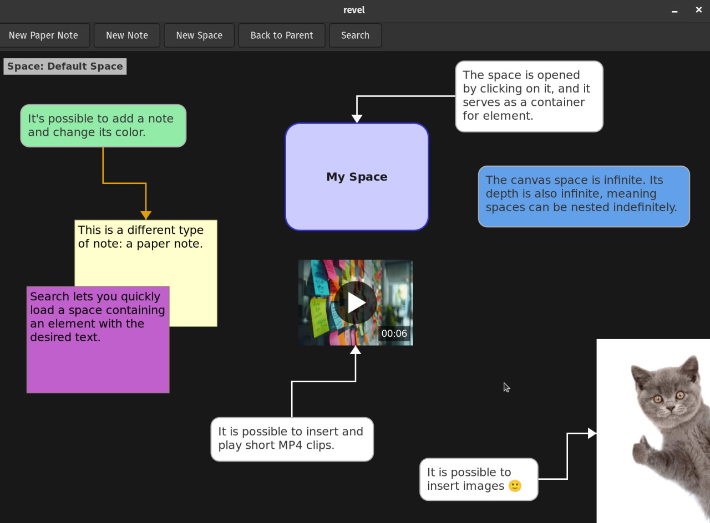

Let me introduce you to [Revel](https://github.com/Dimchikkk/revel): a note-taking and brainstorming app.
I built it over two weeks, so it's very much in the prototype phase - but it's already usable and useful to me. The main features include:

*   Store all data in a single portable SQLite3 database file
*   Full-text search using BM25 ranking
*   Store & play short MP4 clips
*   Create notes and paper notes
*   Connect elements with arrows
*   Paste images and annotate them
*   Fork = independent copy. Clone = by text or size, with properties kept in sync between elements
*   Resize, move, delete, and change color of elements
*   Infinite canvas space
*   Organize elements into nested spaces (infinite space depth)
*   Move elements between spaces

The app is written in C using SQLite3 for the storage layer, GTK4 for the UI layer, and GStreamer for playing MP4 videos. Even though I used AI to write part of the code, it was an opportunity to learn C and experience how awesome C is.

Why would anyone in 2025 write an app in C when there is Rust and other shiny languages? Let me tell you that I already tried Rust for building a GUI app, and the experience wasn't as nice or enjoyable as with C. Someone would say that I'm just holding it wrong and that Rust is awesome. I believe it is awesome, but not for building a GUI drawing app - and yes, I know what I'm talking about since I built [Velo](https://github.com/Dimchikkk/velo) some time ago. Revel can be considered Velo version 2.

Considering the state of UI development in 2025, I believe C and GTK4 are among the best choices for building GUI desktop apps. I was watching "The Last Kingdom" and King Alfred said that what is written in books about him will remain in history, but Uhtred will be forgotten. I was thinking about that.
In the Middle Ages, people wrote on cave walls to transmit knowledge. Then, in Alfred's time, people used books. What is the way of transmitting knowledge in 2025 apart from text? Images? Sort of - but look at what young kids are watching all the time: shorts! So I decided to include support in my note-taking, brainstorming knowledge base app not only for images but also for short MP4 clips! I deliberately chose to keep everything in a single portable SQLite3 database file. I estimated the size needed to store important images and short videos, and a 1TB external SSD (which costs about $100) will probably be enough for my lifetime. I am not looking for contributors for this project since the feature set should come from my personal usage, but everyone is welcome to fork the repo and adjust it for their own needs.

There are a couple of ideas worth mentioning that are implemented in this app.
The first idea is the Space concept. Basically, a Space is a container for elements and is an element itself.
This means a space can contain other spaces, so the app can hold infinite depth of spaces. Each space is itself an infinite canvas... so it's horizontal and vertical infinity, which I find awesome. Another interesting idea implemented in this app is the ability to clone/fork elements. A fork is just an independent copy of an element. A clone can be done by text (content) or by size (visual)... at the moment, only these two properties are supported for cloning, but in general, the app supports any property to be clonable... position, color, etc. Basically, let's say we have space A that holds a note with the text "Note". The user can clone it by text, and another note with the same text appears. The user can change the space of the cloned note to space B; now, if the user changes the text from "Note" to "etoN", it will be reflected in both notes. That's what clone by text essentially means. Another idea is changing the space of elements, including space visual representations.
This means it's possible to loop spaces: space A is the parent of B, and space B is the parent of A. Or it's possible to create a "memory leak" of a space - kind of like removing a pointer to a space from its current space or its ancestors. But actually, it's not really a leak since there is search functionality in the app that allows you to find any element, including lost spaces. By the way, the app uses full-text search with BM25 ranking thanks to SQLite3.

Going back to the usefulness of this app: I am a true believer that we create our own reality and in the importance of the [dream board](https://www.actualityofbeing.com/dreamboard-1). Since this app supports notes, images, and videos, it can be used as a digital form of it. Another use case: in every job I've worked, there was some sort of internal knowledge; people showed you how to do something, but it wasn't captured anywhere. This app can be used as an internal wiki, and with full-text search, it can be super handy.
At the moment, I am looking for a job, so if you can suggest any permanent role where people are solving complex technical challenges, feel free to send a message to: velo.app1@gmail.com.

